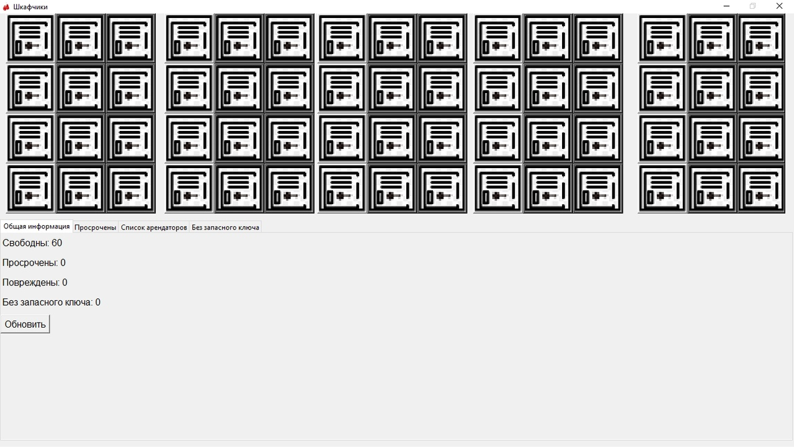
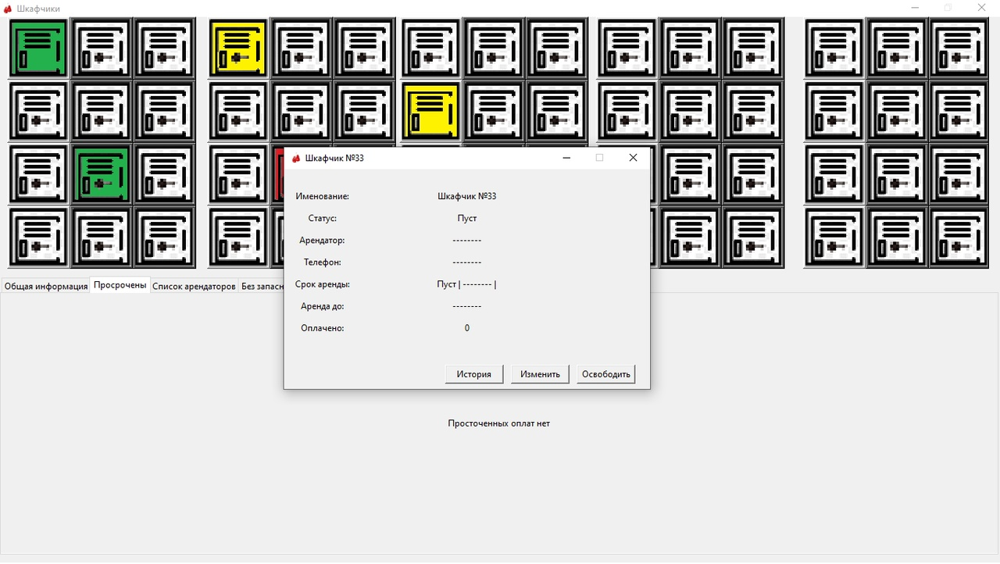
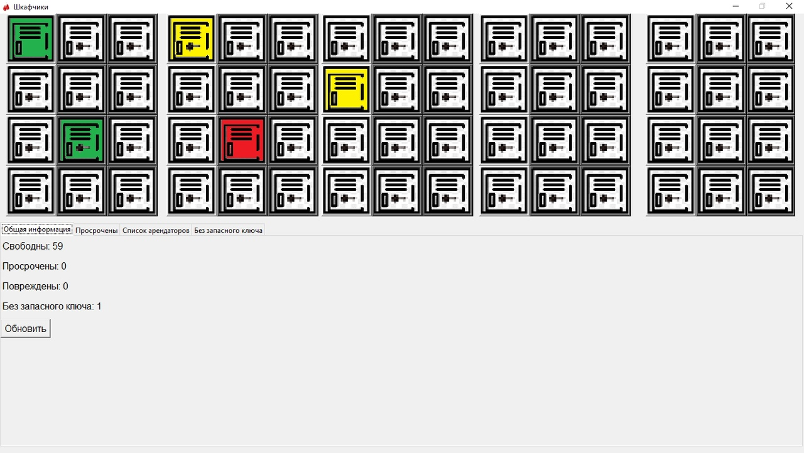

# LockerBox # 

Program for monitoring payments for cells leased
The program maintains its database and counts the number of remaining days of paid rent. 
After the lease expires, it changes the status of the cell on its own, informing the user about it.

## Graphic display of cell statuses ##
At the top of the screen

The user has 60 cells. Each cell has the following states:
  With spare key(Image of the key on the cell):
    - Free (White);
    - Busy and paid (Green);
    - Busy and overdue (Red);
    - Broken (Yellow);
    
  No spare key(The key image is missing from the cell):
    - Free (White);
    - Busy and paid (Green);
    - Busy and overdue (Red);
    - Broken (Yellow);
    
   
   
## Information table ## 
Located at the bottom of the screen

The table displays general data on frames: 
  -The situation as a whole 
  -Tenants 
  -Cells with overdue payments 
  -Cells with missing spare keys

## Installation and launch ## 
Launch can only be done when using python 3.x

To start you need:
  - Run command `pip3 install -r requirements.txt`
  - Run file `LockerBox.py`
  
## To run in the python3 interpreter environment, you must run the commands ##
- `make`
- `source env/bin/activate`
- `python3 -m pip install -r requirements.txt`
- `python LockerBox.py`
- after the end of the program, you must deactivate env with the command: `deactivate`

## Assembly to .exe ##
  - Open windows command line
  - Install pyinstaller

  `pip install pyinstaller`

  - Next, change to the folder containing the .py file on the command line (using the cd command)
  - Run the pyinstaller command without specifying the name of your script

  `pyinstaller --onefile --onefile --icon=./imahes/boxing.ico LockerBox.py`

  - That's it - you will have a src folder in your folder and there will be an .exe file.
